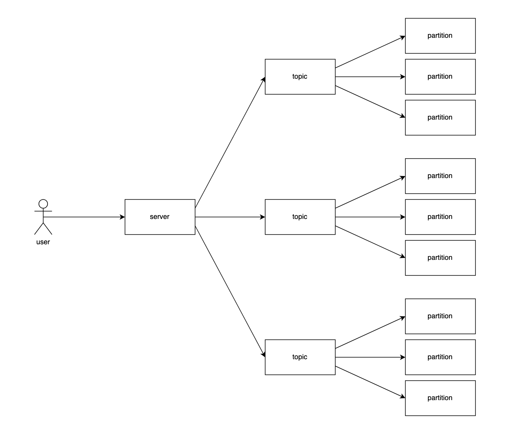

# Distributed Message Queue

An implementation of a Kafka-like distributed message queue in C. This
distributed system uses a custom application-layer network protocol called
DMQP and Apache ZooKeeper for distributed consensus and metadata.

## Features
- Partitions: Topics, Sharding, Replication
- Networking: DMQP (Custom Application-Layer Protocol)
- Reliability: Ordering, Atomicity, Security, Fault Tolerance

## Design

### Architecture



Partitions are nodes that store queues and host DMQP servers. Once partitions
boot, they are registered into the distributed system's metadata via ZooKeeper.
They are initially marked as free (unused) partitions.

When a client creates a new topic, free partitions are allocated for the topic.
For instance, if a client creates a new topic with 2 shards and a replication
factor of 3, 6 partitions are allocated in total. Each shard is allocated 3
partitions. Different shards store different data, but replicas of the same
shard store the same data. Sharding and partitioning provide horizontal scaling
and fault tolerance.

Each shard has a partition that is elected as a leader. A write must be
replicated by the entire shard's replica set before the request is fully
serviced. A read can be serviced by any partition in the shard's replica set.

Data is distributed between shards using Round-Robin.

Here's a walkthrough of a write to a topic:
1. User sends a write request to the client with a Topic ID
2. Client queries ZooKeeper for the IP addresses and ports of the topic's
shards. The client is only interested in partitions that are elected leaders for
that shard
3. Client applies Round-Robin to distribute data evenly and prevent hotspots
4. Data is persisted by the partition both in-memory and on disk

Users can interface with this distributed system using a client defined in
`include/api.h`.

### Distributed Consensus

As mentioned above, this distributed system uses ZooKeeper for distributed
consensus and metadata. The following are formats of ephemeral nodes in
ZooKeeper:

```
/free/{partition_ip_addr}:{partition_port}
/topics/{topic_id}/sequence_id
/topics/{topic_id}/consumers/{consumer_id}
/topics/{topic_id}/shards/{shard_id}/leader/{partition_ip_addr}:{partition_port}
/topics/{topic_id}/shards/{shard_id}/replicas/{partition_ip_addr}:{partition_port}
```

### Networking

This distributed system uses a custom application-layer protocol called DMQP.
DMQP stands for Distributed Message Queue Protocol. DMQP uses TCP with
persistent connections, leveraging keepalive to preserve resources only for
active queue producers and consumers while maximizing throughput. Socket
operations in DMQP have a timeout of 30 seconds each.

A DMQP message uses the following format:
```
+------------------------------------------+
|           Sequence ID (4 bytes)          |
+------------------------------------------+
|             Length (4 bytes)             |
+------------------------------------------+
| Method (2 bytes) | Status Code (2 bytes) |
+------------------------------------------+
|             Payload (Max 1MB)            |
+------------------------------------------+
```
The `Sequence ID` header contains the unique sequence number of a queue entry.
This is used for message ordering.
The `Length` header states the size of the payload in bytes.
The `Method` header can be one of the following:
```
DMQP_PUSH
DMQP_POP
DMQP_PEEK_SEQUENCE_ID
DMQP_RESPONSE
```
The `Status Code` header is a Unix `errno`.
The `Payload` contains data to be pushed onto the queue.

`DMQP_PUSH` and `DMQP_POP` are self-explanatory. `DMQP_PEEK_SEQUENCE_ID` returns
the sequence ID of the queue's head entry. `DMQP_RESPONSE` is specified if the
message is a response to a request.

### Reliability

#### Ordering & Atomicity

All queue operations at the partition level are protected by mutex locks. This
guarantees ordering and atomicity at the partition level. All ZooKeeper
operations used by the client are atomic.

Consumers will be assigned specific shards to consume from. This reduces the
overhead of peeking at every shard, only the specific shards that are assigned
to that consumer. Ideally, there is one consumer per shard. There cannot be more
consumers than shards. If there are less consumers than shards, consumers have
to peek the sequence ID of each assigned shard to determine the true head of
their assigned shards. This ensures that consumers process messages in order.

Consumers are registered at the following ephemeral ZooKeeper node:
```
/topics/{topic_id}/consumers/{consumer_id}
```

The client determines how to balance shards between consumers.

#### Security

All network messages are encrypted using TLS. Data is encrypted prior to any
persistence on disk.

#### Fault Tolerance

Shards are replicated, providing redundancy. Therefore, if one replica fails,
there are others that can still service requests.

Furthermore, all writes are simultaneously persisted to disk (write-through).
When a partition boots, it looks for any available disk logs to recover. This
provides crash recovery, since if an entire replica set fails, restarted nodes
can recover all data persisted to disk.

## Quick Start

### Requirements
- Docker

Enter the Docker container:
```bash
# run `chmod +x ./scripts/docker.sh` if permission denied
./scripts/docker.sh # add flag --attach to attach to running container
```

Compile and start a partition:
```bash
make
./partition/partition
```

## Backlog
- [ ] Leader Election (e.g. Split Brain)
- [ ] Write-Through -> High Latency
- [ ] Synchronous Replication -> High Latency
- [ ] Compaction / Retention Policy (Queues May Grow Indefinitely)
- [ ] Caching Metadata from ZooKeeper
